# [HCMUS][CSC11007] Deploy Spring PetClinic Sample Application built with Spring Cloud and Spring AI


This project is forked from [spring-petclinic-microservices](https://github.com/spring-petclinic/spring-petclinic-microservices) and modified to deploy on kubernetes


## Acknowledgement
This project is based on the original Spring PetClinic Microservices project. The application source code belongs to the Spring PetClinic contributors.

The original application is developed and maintained by the Spring PetClinic contributors.

This repository contains only the CI/CD and GitOps workflow using Jenkins, Docker, Kubernetes and Argo CD implementation created for the course project in HCMUS - CSC11007 DevOps Fundamentals course.


## Original Project
Application source: [https://github.com/spring-projects/spring-petclinic](https://github.com/spring-projects/spring-petclinic)

This repository only contains the DevOps infrastructure and deployment workflow developed for academic purposes.


## I. Project Description

In this course project, students are required to design and implement a complete CI/CD and monitoring system to deploy, operate, and manage the Spring PetClinic Microservices application.

The application is based on the official Spring PetClinic Microservices project:
https://github.com/spring-petclinic/spring-petclinic-microservices

PetClinic is a microservices-based application for managing veterinary clinics and pet healthcare. It consists of the following services:

- Eureka Service (Discovery Server): Service registration and discovery.
- Admin Server: Monitoring and management of internal microservices.
- Zipkin: Distributed tracing and logging.
- API Gateway: Entry point and web UI gateway for the system.
- Customers Service: Manages customer information.
- GenAI Service: Provides chatbot functionality.
- Vets Service: Manages veterinarian information.
- Visits Service: Manages pet visit and treatment records.

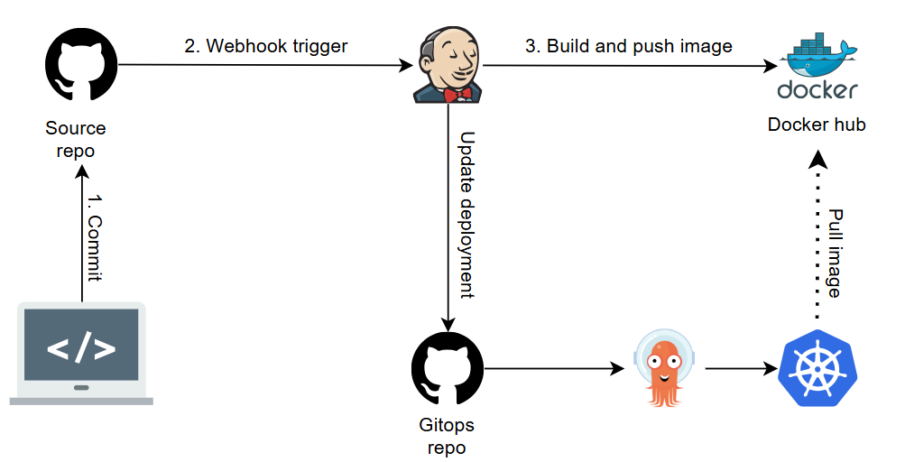

## II. Requirements

Students must use Jenkins to build a CI/CD pipeline with the following requirements.

### 1. Default Docker Images
Every microservice has a default Docker image tagged as latest.

### 2. Kubernetes Cluster
Deploy the application on a Kubernetes cluster with:
- 1 Master (Control Plane) node
- 1 Worker node

### 3. Continuous Integration (CI):
For every developer branch:
Trigger the pipeline after each commit. Build a Docker image for the modified service. Tag the image with the latest commit ID (SHA) of that branch. Push the image to Docker Hub.


### 4. Developer CD Pipeline
Create a Jenkins job named developer_build.
This job allows developers to specify which branch should be deployed for each service.

Example:
A developer is working on the branch: dev_vets_service

The developer only modified the Vets Service.

In the developer_build job:
- Vets Service:	dev_vets_service
- All other services:	main

The deployment should use:
main images for every unchanged service.
The commit-SHA image generated in Requirement 3 for dev_vets_service.

After deployment, Jenkins must provide: Domain name + NodePort
Developers will manually map the domain to the Kubernetes Worker Node by editing their local hosts file (DNS is not required).


### 5. Cleanup Pipeline
Create a Jenkins job to remove the deployment created in Requirement 4.
The cleanup job should delete the developer namespace and all deployed resources.

### 6. GitOps-based CD Pipelines
Create two additional Jenkins CI/CD pipelines for Development and Staging environments.

#### 6.1 Development Environment
Trigger automatically when the main branch changes.
Continuously overwrite the deployment in the dev namespace.
#### 6.2 Staging Environment
Create a release by tagging the main branch (e.g., v1.2.3).
The pipeline detects the Git tag. Build Docker images using the release tag (e.g., v1.2.3). Push the release images to Docker Hub. Deploy the release into the staging namespace.

## III. Tutorials
### 1. Jenkins Setup
- Choose a JDK version, i use JDK 21 Adoptium Eclipse Temurin. You can choose which JDK version at: https://whichjdk.com/
- Install Jenkins on a server or local machine at: https://www.jenkins.io/download/

### 2. Docker setup
- Install Docker on your machine at: https://docs.docker.com/desktop/
- I'm using Docker Desktop for Windows, you can choose which version at: https://docs.docker.com/desktop/install/windows-install/

### 3. Multipass setup
- Install Multipass on your machine at: https://canonical.com/multipass/install

### 4. Kubernetes setup
- You can create the 2 VMs (master and worker) using scripts `multipass/create_VMs.ps1` on windows:

```
.\multipass\create_VMs.ps1
```
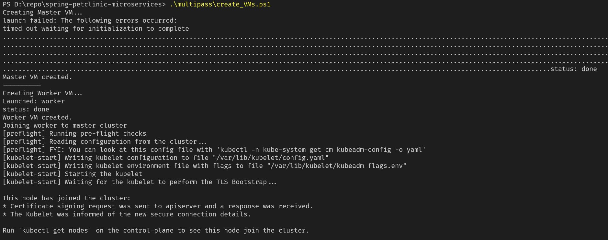
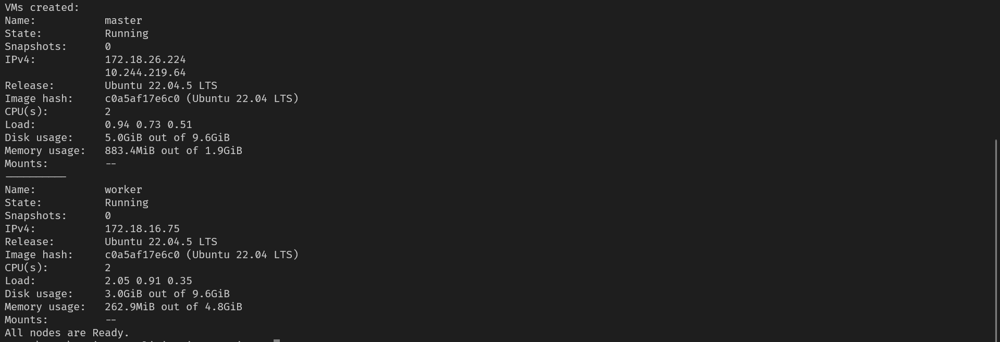

- This script will create 2 VMs named `master` and `worker` with the following configuration:
  - Master node: 2 CPU, 2GB RAM, 10GB disk
  - Worker node: 2 CPU, 5GB RAM, 10GB disk
  - Run cloud init
  - Connect worker node to master node

- After creating the VMs, you can check the status of the VMs by running the following command:

```
multipass list
```
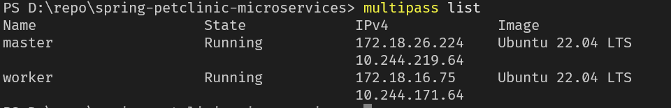

- Argo CD is also installed on the master node. To access Argo CD UI you can use port-forward command on master node:

```
multipass exec master -- kubectl port-forward --address 0.0.0.0 -n argocd svc/argocd-server 30443:443
```
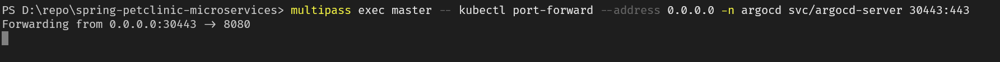
- then access the Argo CD UI at: `http://<master-node-ip>:30443` on browser. 
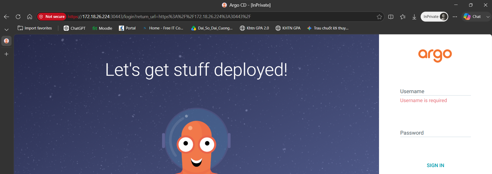

Default username is `admin` 

Default password is the initial admin password which can be retrieved by running the following command on the master node:
1. access the master node:
```
multipass shell master
```
2. run the following command to get the initial admin password:
```
kubectl -n argocd get secret argocd-initial-admin-secret -o jsonpath="{.data.password}" | base64 -d; echo
```
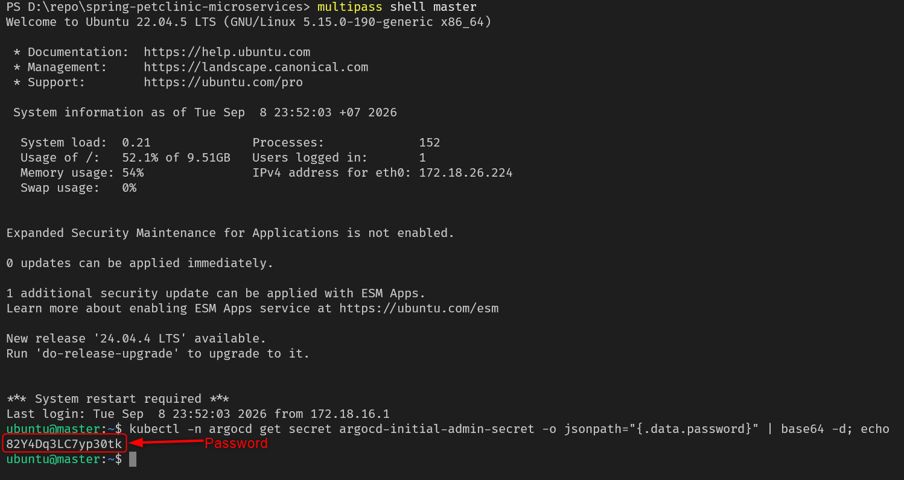

### 5. Argo CD setup
- Apply the Argo CD application manifests by running the following commands on the master node:

`dev` namespace:

```
multipass exec master -- kubectl apply -f https://raw.githubusercontent.com/DipHuy/HCMUS-Intro_DevOps-gitops-spring-petclinic-microservices/refs/heads/main/argocd/dev.yaml
```

`staging` namespace:

``` 
multipass exec master -- kubectl apply -f https://raw.githubusercontent.com/DipHuy/HCMUS-Intro_DevOps-gitops-spring-petclinic-microservices/refs/heads/main/argocd/staging.yaml
```

- To check the status of the applications, run the following command on the master node:

```
multipass exec master -- kubectl get applications -n argocd
```

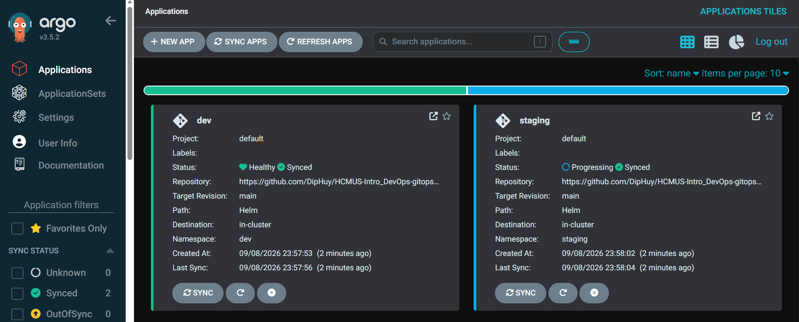

### 6. GitHub setup
- Create a source repository on GitHub (now called `Source Repo`) is a fork of the original repository (https://github.com/spring-projects/spring-petclinic) and a GitOps repo on GitHub (now called `GitOps Repo`) to store the Argo CD application manifests.

- Example:
  - `Source Repo`: https://github.com/DipHuy/HCMUS-Intro_DevOps-spring-petclinic-microservices
  - `GitOps Repo`: https://github.com/DipHuy/HCMUS-Intro_DevOps-gitops-spring-petclinic-microservices

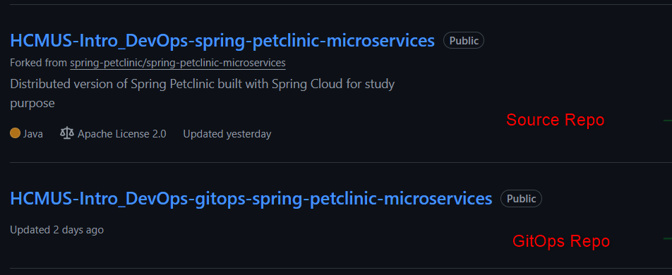

- Create Personal Access Token (PAT) with repo permission at https://github.com/settings/personal-access-tokens
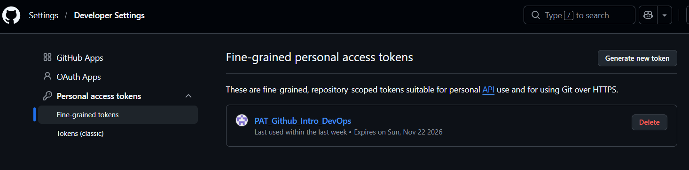
  - Repository access: `Only select the repositories` choose `Source Repo` and `GitOps Repo`
  - Permission (repositories): 
    - `contents`: Access: Read and write
    - `Webhooks`: Access: Read-only
    - `Pull requests`: Access: Read-only

    - Note: The PAT will be used to authenticate Jenkins to access the GitHub repository. You must save the PAT somewhere safe, as it will not be shown again after creation.
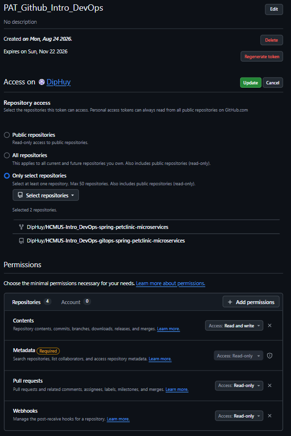

### 7. Docker Hub setup
- Create a Docker Hub account at https://hub.docker.com/
- Create a Personal Access Token (PAT) with read and write permission at https://app.docker.com/accounts/"<username>"/settings/personal-access-tokens
- Note: The PAT will be used to authenticate Jenkins to access Docker Hub. You must save the PAT somewhere safe, as it will not be shown again after creation.
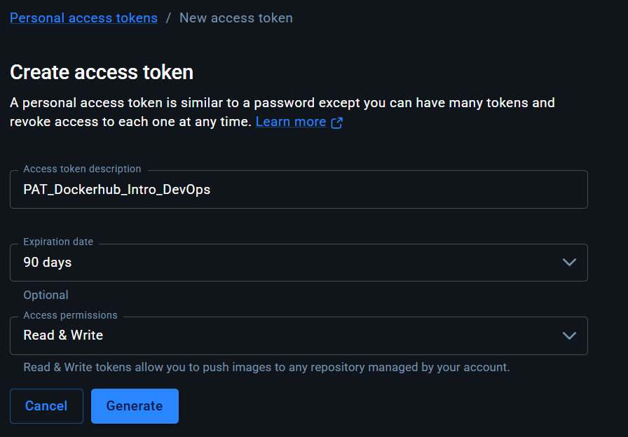
### 7. Jenkins CI Pipeline setup
- Create multibranch pipeline job named `CI` in Jenkins.

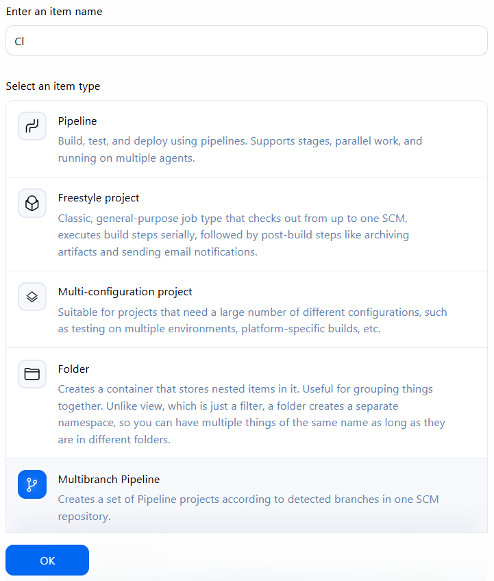
  - Credentials: 
    - Github: Create a Global System credential with your GitHub personal access token (PAT)
      - Type: Username with password
      - Username: your GitHub PAT name
      - Password: your GitHub PAT value
      - ID: `PAT_Github_Intro_DevOps` (this ID will be referenced by Jenkins)
    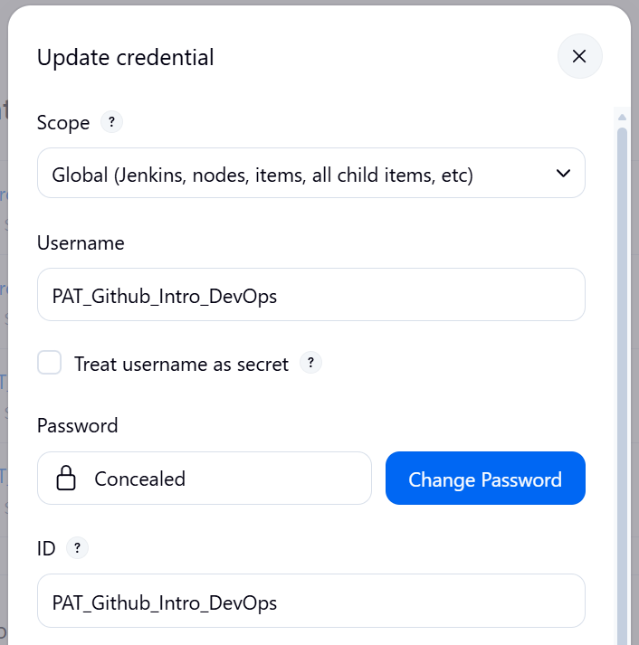
    - Docker Hub: Create a Global System credential with your Docker Hub personal access token (PAT)
      - Type: Username with password
      - Username: your Docker Hub username
      - Password: your Docker Hub PAT value
      - ID: `PAT_Dockerhub_Intro_DevOps` (this ID will be referenced by Jenkins)
      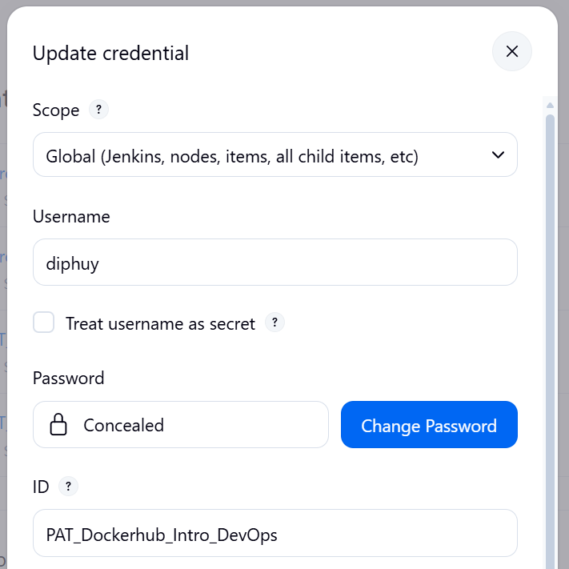
  - Branch source: GitHub (use GitHub will automate use trigger webhook)
    - Repository: `Source Repo`
    - Credentials: `PAT_Github_Intro_DevOps` (this ID will be referenced by Jenkins)
    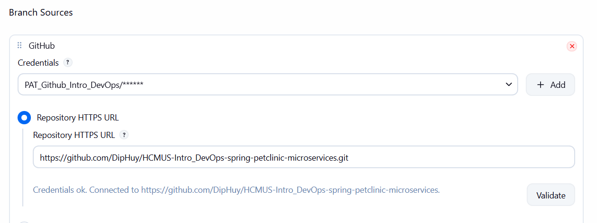
    - Behavior: 
      - Discover branches (All branches)
      - Discovery tags
    - Properties strategy: All branches get the same properties
    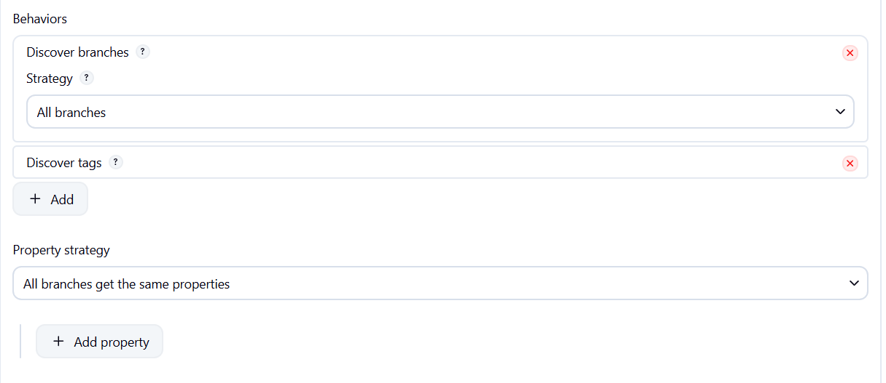
    - Build Strategy (from plugin [Basic Branch Build Strategies](https://plugins.jenkins.io/basic-branch-build-strategies/)): 
      - Regular build
      - Tags
    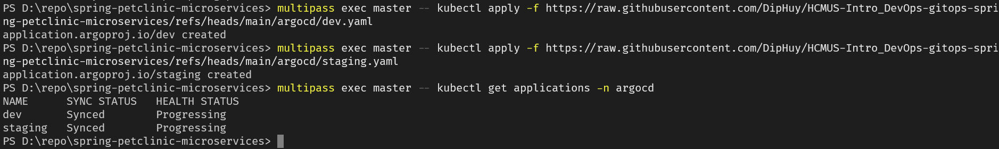
    - Script Path: `Jenkinsfiles/Jenkinsfile-CI`
    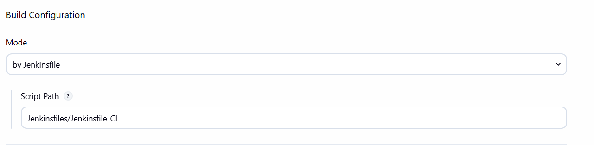


- Purpose: This pipeline will automatically build and push Docker images for each microservice when a developer pushes code to their branch. The images will be tagged with the commit SHA.

### 8. Jenkins Developer CD Pipeline setup
- Create a pipeline job named `developer_build` in Jenkins.
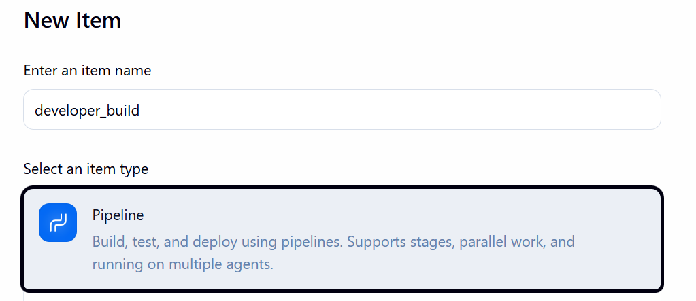
  - Credentials:
    - Github: GitHub PAT created in the CI pipeline setup.
    - Docker Hub: Dockerhub PAT created in the CI pipeline setup.
    - Kubernetes: Create a Global System credential with your Kubernetes config file (kubeconfig) for the cluster.
      - Type: Secret file
      - File: Upload your kubeconfig file in master node (get at ~/.kube/config or you can use command `multipass transfer master:.kube/config <your-local-path>`)
      - ID: `Intro_DevOps_Kubeconfig` (this ID will be referenced by Jenkins)
  - Parameters:
    - discovery-server, string parameter, default value: main
    - config-server, string parameter, default value: main
    - api-gateway, string parameter, default value: main
    - customers-service, string parameter, default value: main
    - vets-service, string parameter, default value: main
    - visits-service, string parameter, default value: main
    - zipkin, string parameter, default value: main
    - gen-ai-service, string parameter, default value: main
    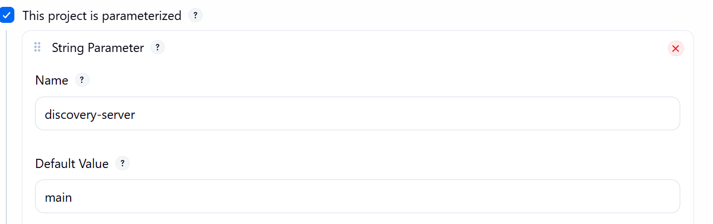
  - Repository: `Source Repo`
  - Credentials: `PAT_Github_Intro_DevOps` (this ID will be referenced by Jenkins)
  - Pipeline script: `Jenkinsfiles/Jenkinsfile-Developer-CD`

- Purpose: This pipeline will deploy the specified branches of each microservice to the Kubernetes cluster. It will use the latest images (default)for unchanged services and the commit-SHA image for modified services.

### 9. Jenkins Cleanup Pipeline setup
- Create a pipeline job named `cleanup` in Jenkins. This pipeline can be trigger by user after `developer_build` pipeline run and print out the trigger url for user cleanup the deployment.
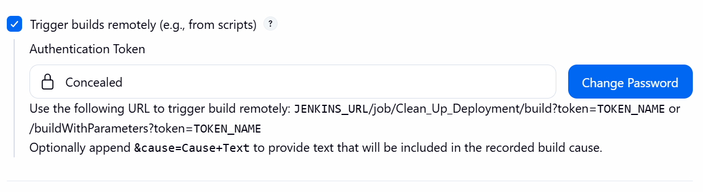
  - Parameters:
    - namespace, string parameter (this is the namespace created by `developer_build` pipeline)
  - Credentials:
    - Kubernetes: Use the same Kubernetes credential created in the Developer CD Pipeline setup.
  - Repository: `Source Repo`
  - Credentials: 
    - Github: `PAT_Github_Intro_DevOps` (this ID will be referenced by Jenkins)
    - Auth token: `Intro_DevOps_CleanUp_Auth_Token`
  - Pipeline script: `Jenkinsfiles/Jenkinsfile-Cleanup`


### 10. Jenkins GitOps CD Pipeline setup
#### 10.1 Development Environment
- Create a multibranch pipeline job named `CD-Dev` in Jenkins. This pipeline will be triggered automatica when CI pipeline branch `main` done.
  - Triggers: `Build after other projects are built` (select `CI/main` pipeline)
  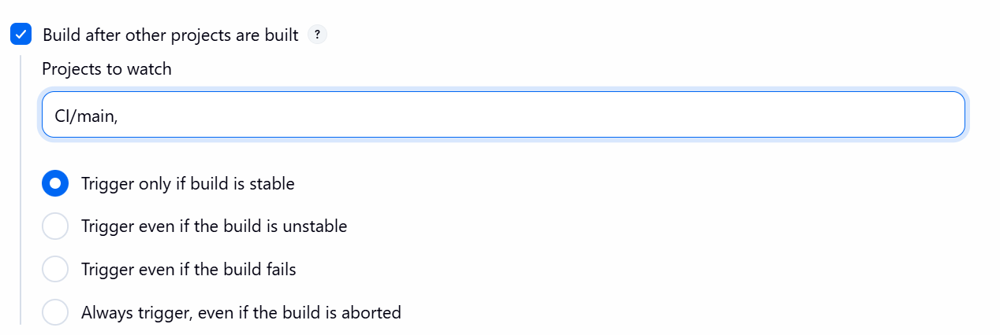

  - Branch source: Git
    - Repository: `Github Repo`
    - Credentials: `PAT_Github_Intro_DevOps` (this ID will be referenced by Jenkins)    
    - Script Path: `Jenkinsfiles/Jenkinsfile-Dev-CD`

#### 10.2 Staging Environment
- Create a multibranch pipeline job named `CD-Staging` in Jenkins. This pipeline will be triggered automatica when CI pipeline  tag done (Jenkinsfile-Ci will trigger in code, you don't need to configure in Jenkins UI like `CD-Dev` pipeline)
  - Branch source: Git
    - Repository: `Github Repo`
    - Credentials: `PAT_Github_Intro_DevOps` (this ID will be referenced by Jenkins)    
    - Script Path: `Jenkinsfiles/Jenkinsfile-staging-CD`

### IV. Demonstration
